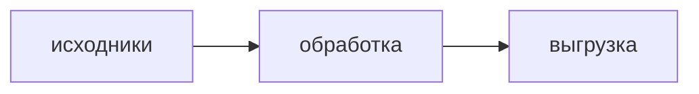

# Описание проекта: контракт формата и рендеринга

> Составлено 2026-08-19. Документ **для обеих сторон**: локального клиента (`fs.manager.tauri`,
> Tauri 2 + React 19 + MUI/emotion) и сайта (`innovation-hub`, Next 16 + React 19.2 + Tailwind +
> Radix/shadcn + `next-themes`).
>
> Зачем: описание проекта пишется в программе, а **показывается на сайте** — и, возможно,
> правится там же. Стеки разные, поэтому формат, набор разрешённой разметки, схема санитайза и
> правила вёрстки фиксируются здесь один раз, а обе стороны реализуют их своими средствами.
>
> Наша сторона: план [`PROJECT_DESCRIPTION_EDITOR_PLAN.md`](./PROJECT_DESCRIPTION_EDITOR_PLAN.md).
> Транспорт: [`R2_SYNC_PLAN.md`](./R2_SYNC_PLAN.md), сайдкары.
> **Копия для сайта положена:** `innovation-hub/docs/DESCRIPTION_FORMAT.md` (та же
> договорённость, но с маппингом палитры на их токены и их CSP/next-нюансами), рядом —
> `innovation-hub/docs/description.example.md`. Правки согласовывать в обе стороны.

---

## 1. Артефакт

| что | значение |
|---|---|
| путь | `options/description.md` внутри проекта |
| кодировка | UTF-8, без BOM, переводы строк `\n` |
| канал | сайдкар: `GET/PUT /api/storage/v1/sidecars?name=description`, `kind: "raw"`, конкурентность через `ifMatch` |
| каталог | строки в `project_files` **нет** — ни `file_id`, ни значка синхронизации, ни `fileId` в дельте. Событие сайдкара без `fileId` — это норма и сигнал «подтяни» |
| SSOT | сам файл. В БД описание не дублировать вторым источником истины — только кэш, если понадобится |
| размер | мягкий предел ~2 МБ: клиент предупреждает автора. Причина — картинки лежат внутри файла (§4), а `PUT` с `ifMatch` возит его целиком на каждое сохранение |
| front-matter | в v1 **не используется**. Зарезервирован: если появится, то YAML в начале файла, и обе стороны обязаны его не печатать как текст |

Имя файла — часть контракта (`Sidecar::Description` у клиента, `projectDescriptionKey` у сайта).
Менять его = править Rust, API и обе реализации одновременно.

---

## 2. Формат: CommonMark + GFM + закрытый список HTML

Базис — **CommonMark**, плюс расширения **GFM**: таблицы, чеклисты (`- [ ]`), зачёркивание
(`~~s~~`), автоссылки. Всё остальное форматирование, которого в markdown нет, выражается
**закрытым** набором HTML-островков:

| тег | атрибуты | зачем |
|---|---|---|
| `u` | — | подчёркивание (в md отсутствует) |
| `mark` | — | быстрая подсветка «по умолчанию»; её рисуют и внешние просмотрщики, включая GitHub |
| `span` | `class` только из палитры §3: `fg-*` (цвет текста) и/или `bg-*` (заливка фона) | цвет и подсветка |
| `div` | `class` = `align-center` \| `align-right` \| `align-left` \| `align-justify` | выравнивание блока |
| `p` | `class` = `indent` | красная строка |
| `br` | — | перевод строки внутри абзаца |
| `details` / `summary` | — | сворачиваемый блок («спойлер») |
| `img` | `src`, `alt`, `title` | картинки, §4 |

**Запрещено везде и всегда:** `style`, `width`, `height`, `align`-атрибут, `class` вне списка
выше, `script`, `iframe`, `object`, `embed`, `form`, любые `on*`-обработчики, `id` (клоббер DOM).

### Почему класс, а не `style="color:#89b4fa"`

Две причины, обе практические:

1. **Дизайн-система сайта этого прямо требует.** В `innovation-hub/docs/UI_TOKENS.md` записано:
   цвет задаётся только токеном, «хардкод `#hex` / `rgba()` — ошибка ревью». Класс `fg-yellow`
   мапится в их токен (маппинг — в их копии контракта, §3), hex не мапится ни во что.
   Тема у них сейчас одна, тёмная; появится светлая — поменяется маппинг, а файлы описаний нет.
2. **Санитайз.** Отфильтровать содержимое атрибута `style` надёжно нельзя — это разбор CSS.
   Список допустимых значений `class` проверяется тривиально и точно (§7).

Плата за решение: во внешнем просмотрщике (GitHub, превью VS Code) цвет не покажется — текст
останется обычным. Это осознанная мягкая деградация: смысл не теряется.

### Грабля markdown, общая для обоих редакторов

Блочный HTML **съедает** markdown внутри себя. Так жирный не сработает:

```html
<div class="align-center">**жирный по центру**</div>
```

А так сработает — пустые строки возвращают парсер в режим markdown:

```html
<div class="align-center">

**жирный по центру**

</div>
```

Правило генератора (любого — нашего тулбара, редактора на сайте): блочные обёртки вставлять
**с пустыми строками** вокруг содержимого. К строчным тегам (`span`, `u`, `mark`) это не
относится, внутри них md разбирается нормально.

---

## 3. Палитра цветов

Закрытый список имён. Класс = `fg-<имя>`. Значения — рекомендация; каждая сторона мапит их в
свою тему, важно совпадение **имён**, а не кодов.

| класс | наша тёмная тема | если появится светлая |
|---|---|---|
| `fg-blue` | `#89b4fa` | `#1e66f5` |
| `fg-green` | `#a6e3a1` | `#40a02b` |
| `fg-orange` | `#fab387` | `#fe640b` |
| `fg-red` | `#f38ba8` | `#d20f39` |
| `fg-yellow` | `#f9e2af` | `#df8e1d` |
| `fg-teal` | `#94e2d5` | `#179299` |
| `fg-purple` | `#cba6f7` | `#8839ef` |
| `fg-cyan` | `#74c7ec` | `#04a5e5` |
| `fg-pink` | `#e879f9` | `#c026d3` |
| `fg-muted` | `#9399b2` | `#6c6f85` |

(Тёмные значения — палитра, уже используемая в программе. Светлый столбец — задел: у сайта тема
одна, тёмная, и наши имена там мапятся на существующие токены `--primary` / `--success` /
`--destructive` / `--chart-*` — таблица в `innovation-hub/docs/DESCRIPTION_FORMAT.md` §3, новых
цветов заводить не пришлось.)

Неизвестный `fg-*` санитайзер вырежет → текст останется читаемым, просто без цвета.

### Насыщенность: три ступени на каждый цвет

Суффикс в имени класса: `fg-blue` (насыщенный), `fg-blue-2` (средний), `fg-blue-3` (мягкий).
Ступень задаётся **прозрачностью**, а не отдельным оттенком: на тёмном фоне подмешивание фона и
есть «менее насыщенный», и это ровно тот приём, которым набирает оттенки дизайн-система сайта
(«новых цветов не заводим, берём прозрачность от токена»). Значит из одного имени обе стороны
получают одинаковый результат.

| суффикс | текст | заливка |
|---|---|---|
| — | α 1.0 | α 0.28 |
| `-2` | α 0.7 | α 0.18 |
| `-3` | α 0.45 | α 0.1 |

### Серая шкала — отдельно, от белого до чёрного

Без ступеней насыщенности, это не цвет, а «текст потише/поярче»:

| класс | наше значение | у сайта |
|---|---|---|
| `fg-gray-0` | `#ffffff` | `--foreground` |
| `fg-gray-1` | `#d0d3da` | `--ws-text-2` |
| `fg-gray-2` | `#a0a5b0` | `--muted-foreground` |
| `fg-gray-3` | `#6e737e` | `--ws-text-4` |
| `fg-gray-4` | `#3f434c` | `--ws-text-5` |
| `fg-gray-5` | `#0e1014` | `--background` |

> `fg-gray-5` на тёмном фоне практически не читается — он осмыслен только вместе со светлой
> заливкой (`bg-gray-0`, `bg-yellow`). Это не баг палитры, а свойство тёмной темы.

Итого имён: 10 оттенков × 3 ступени + 6 серых = **36**, и столько же с префиксом `bg-`.
Список генерируется из одного места (`COLOR_KEYS` в `src/components/markdown/markdownFormat.ts`),
схема санитайза берёт его же — руками ничего дублировать не надо.

### Заливка фона

Те же 36 имён, класс `bg-<имя>`. Отдельной таблицы значений нет намеренно: **фон — это тот же
цвет подложкой**, с прозрачностью по таблице ступеней выше. Так подсветка остаётся читаемой и не
требует второго набора согласованных кодов.

```css
.bg-yellow { background: color-mix(in srgb, var(--fg-yellow) 25%, transparent); }
```

Правила:

- цвет текста при заливке **не меняется** — иначе контраст становится непредсказуемым;
- `fg-*` и `bg-*` можно ставить на один `span` (`class="fg-red bg-yellow"`);
- быстрая подсветка без выбора цвета — это `<mark>`, а не `bg-*`: тег понимают внешние
  просмотрщики, и он не требует нашей CSS вообще.

---

## 4. Картинки — внутри файла, `data:`-URI

```markdown

```

- разрешённые типы: `image/webp`, `image/jpeg`, `image/png`, `image/gif`;
- клиент **обязан** уменьшать при вставке: до ~1600 px по длинной стороне, webp/jpeg q≈80
  (100–200 КБ на картинку). base64 добавляет к весу ещё около трети;
- **размеры в разметке не указываются никогда** — ни `width`, ни `style`. Масштаб задаёт CSS
  рендерера (§8);
- сайту нужен `img-src 'self' data:` в CSP, иначе картинки не покажутся вовсе. Это самый
  вероятный камень;
- `next/image` для `data:`-URI не годится — обычный ``.

Задел на будущее: если описания начнут распухать, картинки переедут в обычную папку проекта
(`_description/`, папки `_*` синкаются нормально) и в файле останутся относительные ссылки. Тогда
сайту понадобится резолвить их в presigned URL, а клиенту — в asset-протокол (в WKWebView
`file://` не работает). У клиента вставка изолирована в одну функцию именно ради этого перехода;
пока считаем ссылки только `data:`.

---

## 5. Блок-схемы

Фенс с языком `mermaid`:

````markdown

````

- сайт: пакет `mermaid` (^11) в клиентском компоненте через `dynamic import`, тему инициализировать
  по текущей из `next-themes`;
- клиент: отложено — фенс пишется и хранится, но локально показывается как блок кода (пакет
  тяжёлый, ~2–3 МБ);
- **правило для обеих сторон:** незнакомый язык фенса рисуется обычным блоком кода. Никогда —
  ошибкой или пустотой.

---

## 6. Конвейер рендеринга

Библиотеки одинаковые: `unified`-стек — обычные npm-пакеты, работают и в Vite, и в серверных
компонентах Next.

| роль | клиент (уже стоит `react-markdown` 10) | сайт |
|---|---|---|
| разбор + вывод | `react-markdown` ^10 | `react-markdown` ^10 (или `unified` напрямую в server component) |
| GFM | `remark-gfm` ^4 | то же |
| HTML-островки | `rehype-raw` ^7 | то же |
| санитайз | `rehype-sanitize` ^6 + схема §7 | **та же схема, скопированная один в один** |
| стили | своя карта `components` + `MarkdownView.tsx` | `@tailwindcss/typography` (`prose`) + переопределения §8 |
| диаграммы | отложено | `mermaid` ^11, `dynamic import` |

**Порядок плагинов критичен:** `remark-gfm` → `rehype-raw` → `rehype-sanitize`. Если санитайз
встанет раньше `rehype-raw`, разметка либо не разберётся, либо пролезет непроверенной.

**Санитайз обязателен на обеих сторонах, всегда.** Файл приходит по сети и мог быть отредактирован
другой стороной — доверенным содержимым он не является ни для кого.

---

## 7. Схема санитайза — копировать дословно

```js
import { defaultSchema } from 'hast-util-sanitize';

const HUES = ['blue','green','orange','red','yellow',
              'teal','purple','cyan','pink','muted'];
const FG = HUES.map((h) => `fg-${h}`);
const BG = HUES.map((h) => `bg-${h}`);
const ALIGN = ['align-center','align-right','align-left','align-justify'];

export const descriptionSchema = {
  ...defaultSchema,
  tagNames: [...(defaultSchema.tagNames ?? []), 'u', 'mark', 'span', 'details', 'summary'],
  attributes: {
    ...defaultSchema.attributes,
    span: [['className', ...FG, ...BG]],
    div:  [['className', ...ALIGN]],
    p:    [['className', 'indent']],
    img:  ['src', 'alt', 'title'],
  },
  protocols: {
    ...defaultSchema.protocols,
    src: ['http', 'https', 'data'],   // data: нужен для картинок, §4
  },
};
```

Форма `[['className', 'a', 'b']]` — это «атрибут разрешён, но только с этими значениями», то есть
палитра и выравнивания получаются закрытыми на уровне санитайзера, а не на честном слове
редактора. `defaultSchema` (GitHub-совместимая) уже пропускает таблицы, `del`, чеклисты и
`code.language-*` — свой список тегов с нуля не собирать. При обновлении версии
`hast-util-sanitize` сверить, что `className` не отфильтрован для нужных тегов.

---

## 8. Вёрстка: правила, без которых описание разваливается

Адаптивность — свойство **CSS рендерера**, а не формата. Развал на другом размере экрана всегда
приходит из жёстких размеров в разметке, поэтому §2 их и запрещает. Со стороны рендерера нужно:

| правило | зачем |
|---|---|
| таблица в обёртке с `overflow-x: auto`, сама `width: 100%`, колонки не фиксированы | широкая таблица иначе растянет всю страницу. **Из markdown обёртку задать нельзя** — её ставит только рендерер |
| `img { max-width: 100%; height: auto }` | картинка 1600 px в колонке 380 px |
| `overflow-wrap: anywhere` для текста и ссылок | длинный путь или URL иначе распирает layout |
| `pre { overflow-x: auto }` | код с длинными строками |
| колонка текста с `max-width` (~820 px), контейнер тянется | читабельная строка на широком мониторе |
| классы `fg-*`, `align-*`, `indent`, `mark`, `details` | §2–3; в Tailwind — плагин `typography` не знает их, добавить своими правилами |

---

## 9. Если сайт тоже редактирует

- на выходе — **только** подмножество §2. Ни одного тега и атрибута сверх списка;
- набор кнопок имеет смысл повторить: он зафиксирован в
  [`PROJECT_DESCRIPTION_EDITOR_PLAN.md`](./PROJECT_DESCRIPTION_EDITOR_PLAN.md) §2 вместе с тем,
  что каждая кнопка пишет в файл;
- блочные обёртки — с пустыми строками вокруг содержимого (§2);
- цвет — только классами из §3, не hex;
- размеры не выдавать вообще;
- запись — `PUT /sidecars` с `ifMatch`; при расхождении не затирать молча, спрашивать автора.
  Локальный клиент делает то же: помнит хэш прочитанного при открытии и сверяет перед записью,
  иначе правка с сайта исчезнет без следа;
- санитайз на **рендере** (§6), а не только на сохранении: файл могли изменить с другой стороны.

---

## 10. Проверка совместимости

Эталонный файл: [`description.example.md`](./description.example.md) — задействует все
разрешённые возможности. Прогнать его через оба рендерера и сравнить глазами; при расхождении
править рендерер, а не файл. При расширении контракта — сначала дописать пример.

---

## 11. Чего не делать

- Не придумывать свой формат (структурный JSON, блочная модель) — файл читают два разных стека и,
  возможно, внешние просмотрщики; выигрыш нулевой, цена — свой рендерер с каждой стороны.
- Не хранить чистый HTML в этом файле: при выключенном raw-html описание превратится в кашу из
  тегов целиком, тогда как md с островками теряет только цвет и выравнивание.
- Не заводить `description.html` и не менять `Sidecar` — имя в контракте с двух сторон.
- Не заливать описание обычным путём `presign` → `PUT` → `notify`: объект ляжет **рядом** с тем,
  который читает сайт (на этом уже обжигались, `R2_SYNC_PLAN.md` п. 25).
- Не создавать подпапки внутри `options/` — бэкенд отдаёт 403 на `mkdir` и `delete`.
- Не пропускать `style` и `width` «на время» — ровно они и ломают верстку на узком экране.
